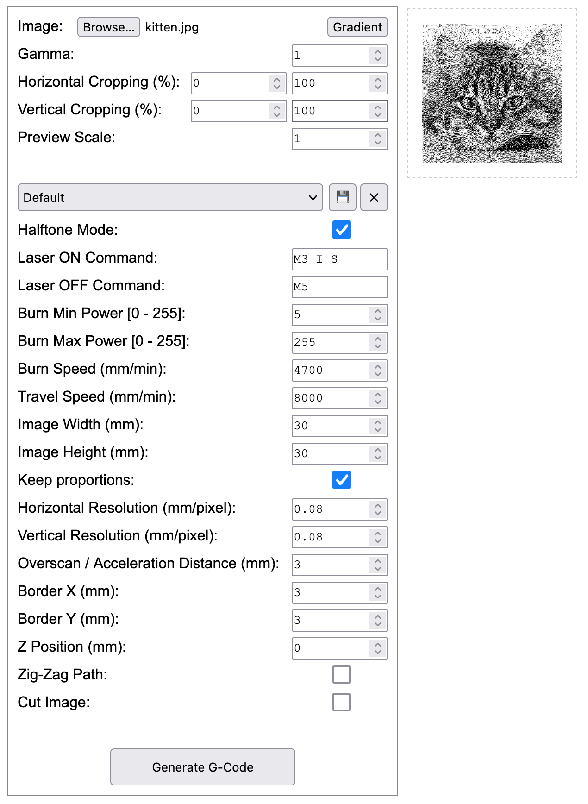
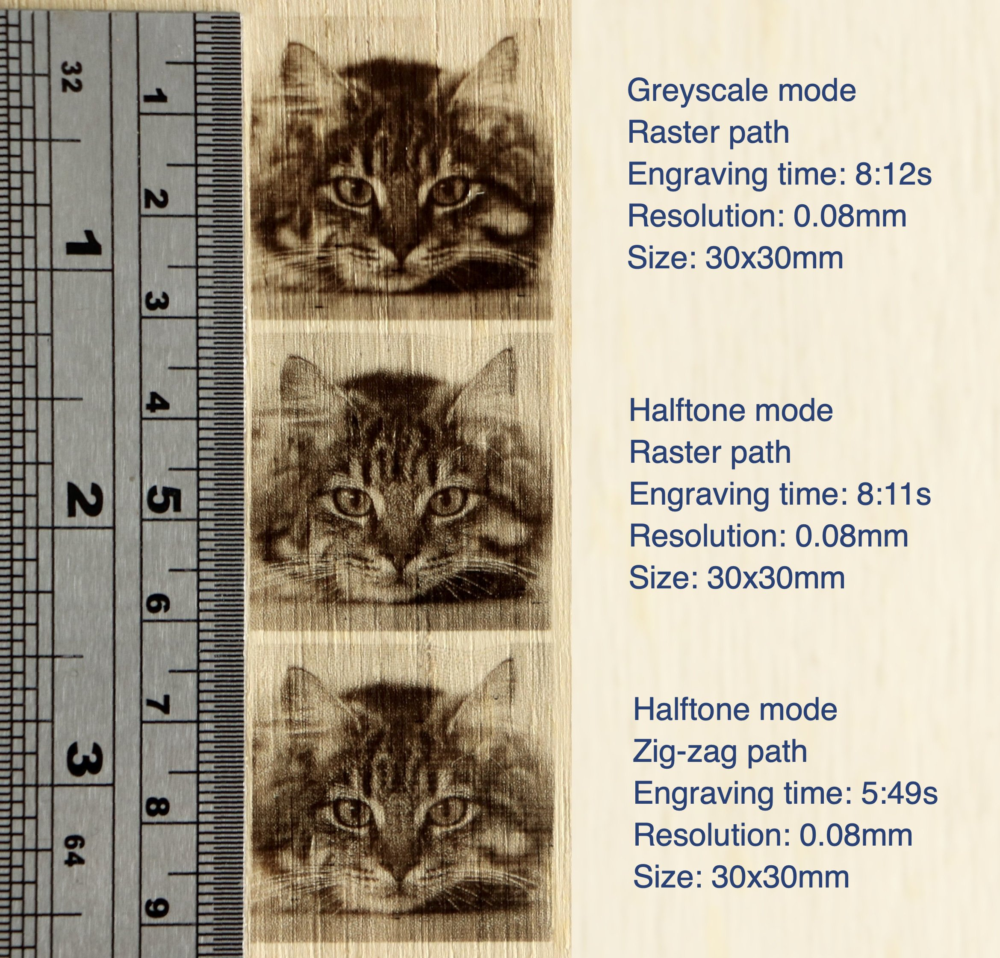

# Image2GCode
Image2GCode is an open source, cross-platform (HTML based) image to G-Code converter for cnc laser engraving machines.

The examples were engraved with a 450nm laser with an optical output power of 5.5W and a laser spot size of 0.08x0.08mm.

## Running the app
Open [Image2GCode](https://htmlpreview.github.io/?https://github.com/damir3/Image2GCode/blob/master/Image2GCode.html) or clone / download the repository and open `Image2GCode.html`.

## Features
- Fully cross-platform application based on one HTML file.
- The preview image is pixel by pixel identical to the engraved image.
- Halftone mode for the best tone reproduction.
- Unlimited number of profiles for engraving settings.
- Zig-zag engraving path support for less engraving time (the quality may be worse on some machines).
- Ability to cut the image after engraving.
